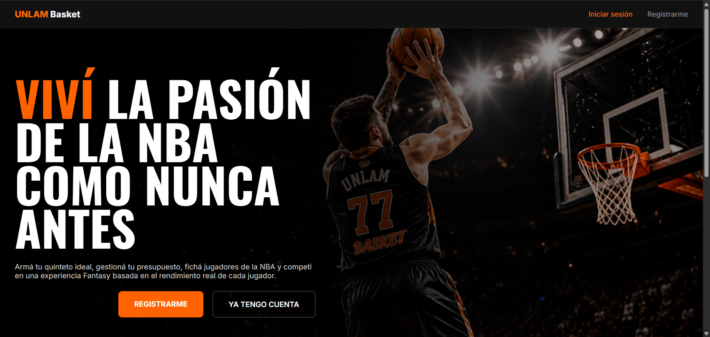
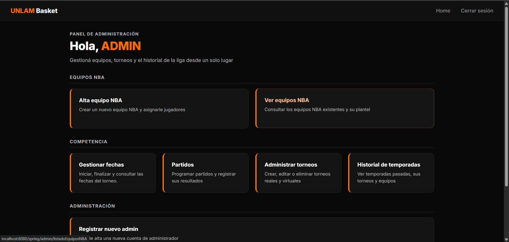
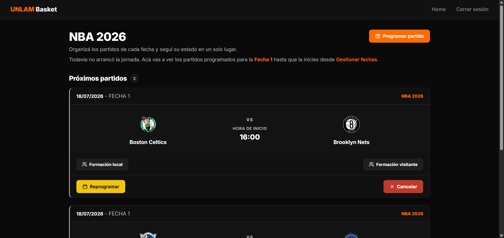
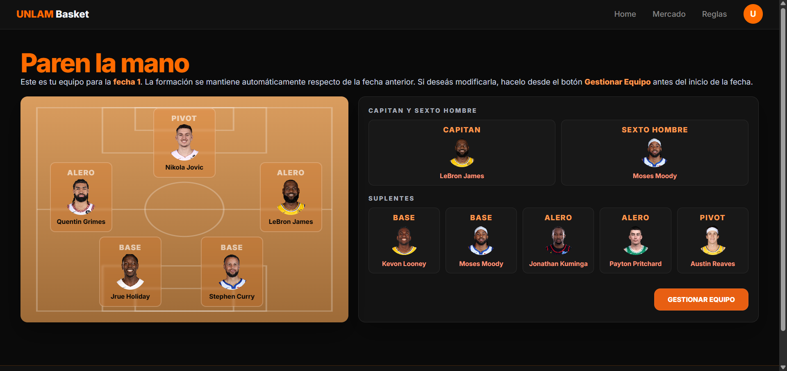

# Basket UNLAM


**Basket UNLAM** es una aplicación web desarrollada como **Trabajo Práctico Grupal** para la materia **Taller Web I** de
la **Universidad Nacional de La Matanza (UNLaM)**.

El proyecto recrea una plataforma de tipo **Fantasy NBA**, donde cada usuario administra su propio equipo utilizando
jugadores reales de la NBA, respetando un presupuesto determinado y compitiendo en un torneo mediante un sistema de
puntajes basado en estadísticas reales.

El objetivo principal fue aplicar los conocimientos adquiridos durante la cursada utilizando **Java**, **Spring MVC**, *
*Hibernate**, **JPA** y una arquitectura en capas, implementando buenas prácticas de desarrollo, persistencia de datos,
testing y trabajo colaborativo.


### Objetivos
---

* Aplicar el patrón MVC.
* Implementar una arquitectura en capas.
* Utilizar Hibernate como framework de persistencia.
* Modelar relaciones entre entidades mediante JPA.
* Implementar reglas de negocio desacopladas.
* Desarrollar una aplicación siguiendo principios de orientación a objetos.
* Gestionar el proyecto utilizando Git y GitHub.
* Realizar pruebas unitarias mediante JUnit y Mockito.

### Funcionalidades
---

#### Administrador

El administrador posee control total sobre la plataforma.

Entre sus funcionalidades se encuentran:

* Inicio de sesión.
* Administración de usuarios administradores.
* Creación de equipos oficiales de la NBA.
* Modificación de equipos NBA.
* Administración de jugadores.
* Asignación de jugadores a los equipos oficiales.
* Creación de temporadas.
* Creación de torneos.
* Asociación de equipos a un torneo.
* Administración general del sistema.

#### Usuario

Cada usuario registrado puede:

* Registrarse e iniciar sesión.
* Crear un equipo Fantasy.
* Participar automáticamente del torneo vigente.
* Seleccionar jugadores para su plantilla.
* Comprar y vender jugadores.
* Administrar el presupuesto disponible.
* Asignar un Capitán.
* Asignar un Sexto Hombre.
* Consultar estadísticas individuales.
* Visualizar el valor de mercado de cada jugador.
* Consultar el puntaje total del equipo.
* Visualizar la tabla de posiciones.
* Modificar su equipo respetando todas las reglas de negocio.

## Arquitectura

El proyecto fue desarrollado siguiendo una arquitectura MVC con separación en capas.

Cada componente posee una única responsabilidad.

```text
Usuario
    │
    ▼
Controller
    │
    ▼
Service
    │
    ▼
Repository
    │
    ▼
Base de Datos
```

# Estructura del Proyecto

```text
src
│
├── main
│   ├── java
│   │
│   └── com.tallerwebi
│       ├── config
│       ├── dominio
│       ├── infraestructura
│       ├── presentacion
│       └── MyServletInitializer
│
│   ├── resources
│   └── webapp
│
└── test
    └── java
        └── com.tallerwebi
            ├── dominio
            ├── infraestructura
            ├── integracion
            ├── presentacion
            └── punta_a_punta
```

---

# Testing

El proyecto incorpora distintos niveles de pruebas automatizadas.

#### Pruebas Unitarias

* Reglas de negocio.
* Servicios.
* Validaciones.
* Cálculo de puntajes.
* Gestión de presupuesto.

#### Pruebas de Persistencia

* Repositorios.
* Consultas.
* Relaciones entre entidades.

##### Pruebas de Presentación

* Controladores MVC.
* Flujo entre vistas y servicios.

## Capturas de Pantalla

<p align="center">
  
</p>

<p align="center">
  
</p>

<p align="center">
  
</p>

<p align="center">
  
</p>
